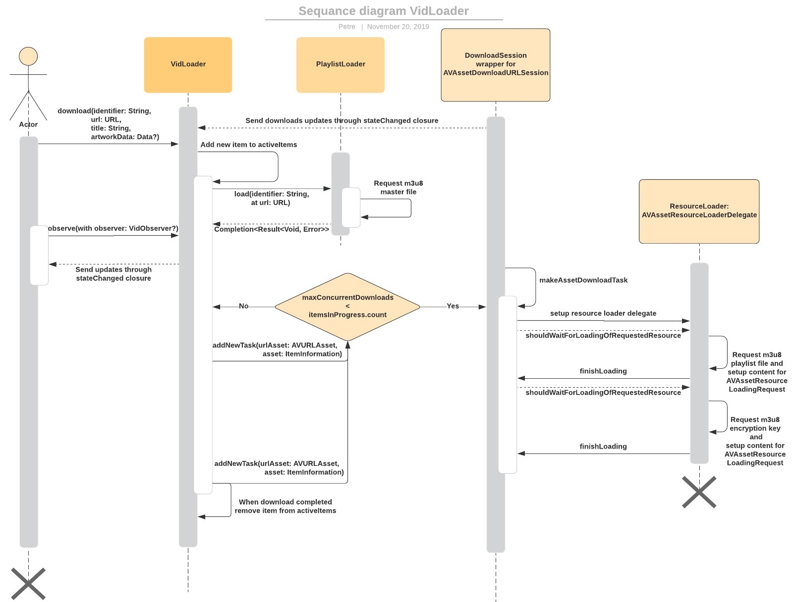

# VidLoader

## Description

*VidLoader* is a framework used to download HLS streams. The main purpose of this library is to explain how to download  an encrypted stream through *AVFoundation* and play it without internet connection. It has as a base the process described on the [Stack Overflow](https://stackoverflow.com/questions/45670774/playing-offline-hls-with-aes-128-encryption-ios/45957045#45957045).  

The library can also be used in the projects through Carthage, CocoaPods or added manually.  

To check how everything works you can run the *VidLoaderExample*, install pods and set up URL for the master **.m3u8** file in the `VideoListDataProvider` -> `generateDefaultItems` -> `defaultURL` property.

This library works with **.m3u8 master** file that looks like:

```
#EXTM3U
#EXT-X-STREAM-INF:PROGRAM-ID=1,BANDWIDTH=1697588,RESOLUTION=1280x720,FRAME-RATE=23.980,CODECS="mp4a"
https://.../playlist_1
#EXT-X-STREAM-INF:PROGRAM-ID=1,BANDWIDTH=1132382,RESOLUTION=848x480,FRAME-RATE=23.980,CODECS="mp4a"
https://.../playlist_2
#EXT-X-STREAM-INF:PROGRAM-ID=1,BANDWIDTH=690409,RESOLUTION=640x360,FRAME-RATE=23.980,CODECS="mp4a"
https://.../playlist_3
```
*VidLoader* will download **.m3u8 master** file and will send it to the `AVAssetDownloadURLSession`.
After this, the session will select the most optimal playlist for the device, then the library will make a request with the selected URL, the **.m3u8 playlist** will look like this:

```
#EXTM3U
#EXT-X-TARGETDURATION:12
#EXT-X-ALLOW-CACHE:YES
#EXT-X-KEY:METHOD=AES-128,URI="https://.../encryption_key”
#EXT-X-VERSION:3
#EXT-X-MEDIA-SEQUENCE:1
#EXTINF:6.006,
https://.../chunk_1
#EXTINF:4.713,
https://.../chunk_2
#EXTINF:10.093,
https://.../chunk_3
#EXT-X-ENDLIST
```

*VidLoader* final step is to request encryption key from URL and to save it in the **.m3u8 playlist**. Next time when the video player will request the key, it will be extracted from the local playlist file instead of doing request.  

The sketchy description how *VidLoader* works is represented in the next diagram:



## Requirements

```diff
+ iOS 12.0+
@@ AVAssetDownloadURLSession doesn't work on the simulator, a real device is required @@
```
## Installation

### CocoaPods

To integrate *VidLoader* into your Xcode project using CocoaPods, specify it in your `Podfile`:

```ObjC
pod 'VidLoader', :git => 'https://github.com/Cyklet/VidLoader.git', :tag => #tag
```

Then, run the following command:

```bash
$ pod install
```

### Carthage

To integrate *VidLoader* into your Xcode project using Carthage, specify it in your `Cartfile`:

```ObjC
github "Cyklet/VidLoader" ~> #tag
```

Run `carthage update` to build the framework and drag the built `VidLoader.framework` into your Xcode project.


### Swift Package Manager

Open Xcode project, select File > Swift Packages > Add Package Dependency and enter GitHub repository URL -> https://github.com/Cyklet/VidLoader

### Manually

If you prefer not to use dependency managers, you can integrate *VidLoader* into your project manually.

## Usage

To use the library, it is suggested to create a singleton of *VidLoader* class (each *VidLoader* instance will have the same session identifier that can lead to unexpected behavior in case of multiple instances) and access public functions of it:
- `func download(_ values: DownloadValues)` call this method to start item download. *DownloadValues* contains:
  - `identifier`: item's unique identifier;
  - `url`: m3u8 URL;
  - `title`: item's title that will be presented in the phone settings;
  - `artworkData`: item's optional thumbnail that will be presented in the phone settings;
  - `minRequiredBitrate`: lowest media bitrate to be used that is greater than or equal to this value, bits per second. If it's nil, then the highest media bitrate will be selected by default;
- `observe(with observer: VidObserver?) `: add an observer that will be called when the state of an item changes;
- `remove(observer: VidObserver?)`: remove observer from observers list;
- `cancel(identifier: String)`: call cancel method when download must be stoped;
- `pause(identifier: String)`: call pause method when download must be suspended;
- `resume(identifier: String)`: call resume method when download must be unpaused;
- `state(for identifier: String) -> DownloadState`: get current download state of the item, if downloader doesn't have any information about it, the state will be **unknown**;
- `asset(location: URL) -> AVURLAsset?`: returns AVURLAsset that will provide the encryption key when video player will demand. The AVAssetResourceLoaderDelegate of the asset will be handled in *VidLoader* framework;
- `cancelActiveItems()`: cancel all active items that are currently downloading or preparing to download;
- `enableMobileDataAccess()`: enable mobile data download availability, if the user has only mobile data connection, download will continue;
- `disableMobileDataAccess()`: disable mobile data download availability, if the user has only mobile data connection, download will be paused;

## Download States
- `unknown`: the framework doesn't have any information about the item, download is not in progress;
- `prefetching`: `.m3u8` playlists files fetching is in progress;
- `waiting`: item is waiting in queue, number of concurrent downloads is set during `VidLoader` init `maxConcurrentDownloads`;
- `running`: item is currently downloading by `AVAssetDownloadURLSession`, with `progress` as an associated value;
- `noConnection`: when the internet connection is not stable download can be suspended automatically to decrease failed downloads, with `progress` as an associated value;
- `paused`: download was suspended by the user, with a `progress` as an associated value;
- `completed`: download just finished, after this, all information about it is removed from the framework, the developer should save file path and download state on their side;
- `canceled`: when system/user cancels download, this state will fire;
- `failed`: as soon as the download will fail this state will fire with `DownloadError` as an associated value;
- `keyLoaded`: framework finished downloading encryption key.

## Configurations

| Configurations
| --- |
| `isMobileDataEnabled` - A property that represents if the user accepts to download streams with mobile data.|
| `maxConcurrentDownloads` - Maximal numbers of streams that will be downloaded at the same time. Please take into consideration, if you increase this number the downloads may start failing because of the *AVAssetDownloadURLSession* limitations.|

## License

MIT License, Copyright (c) 2019 [Petre Plotnic](https://www.linkedin.com/in/petre-plotnic/)
